# Capstone - Azure Machine Learning Engineer
## Project Overview

In this capstone project, I will try to predict if a bank loan will become bad or not. A loan becomes bad when customer is unable to repay the bank loan. I have trained classification model using hyperdrive experiment and automl experiement to determine bad loans.

## Dataset

I have used an open source dataset obtained from kaggle. I uploaded the dataset on google drive as a .csv file in share mode. I consumed this .csv file directly as a tabular dataset in Azure ML models.

The data containes target varaible - "bad_loans", having values 0 for good loan, and 1 for bad loan. And it has features as per the below image.

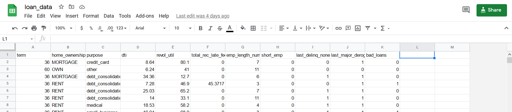

I have injested the dataset using TabularDatasetFactory. A snapshot of the data after injestion is provided below.
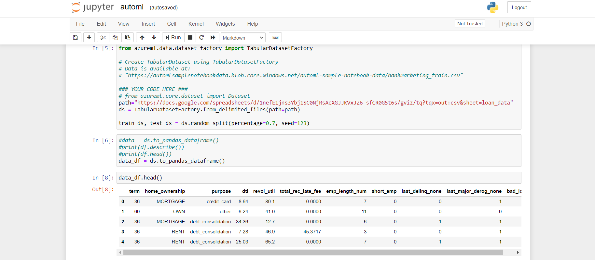

## AutoML Experiment
I have used the below automl_config for the experiment. Have set timeout_minutes to 30 minutes and primary meterics as auc_weighted.
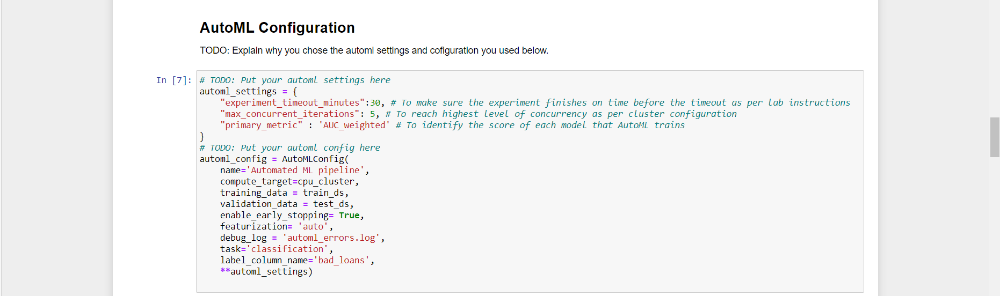 

Once i submitted the run, run details widget shows experiment is running.
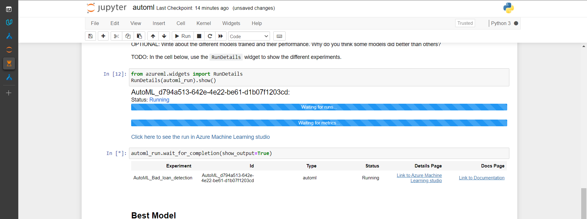
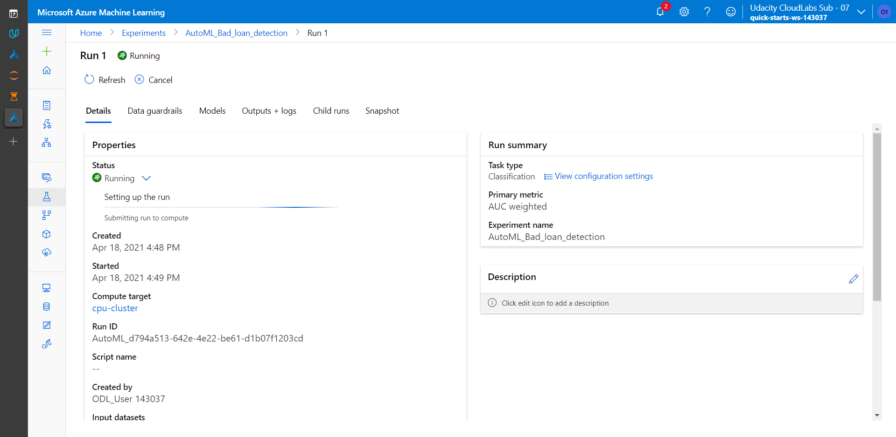

Data gourdrails shows the data quality checks performed. 
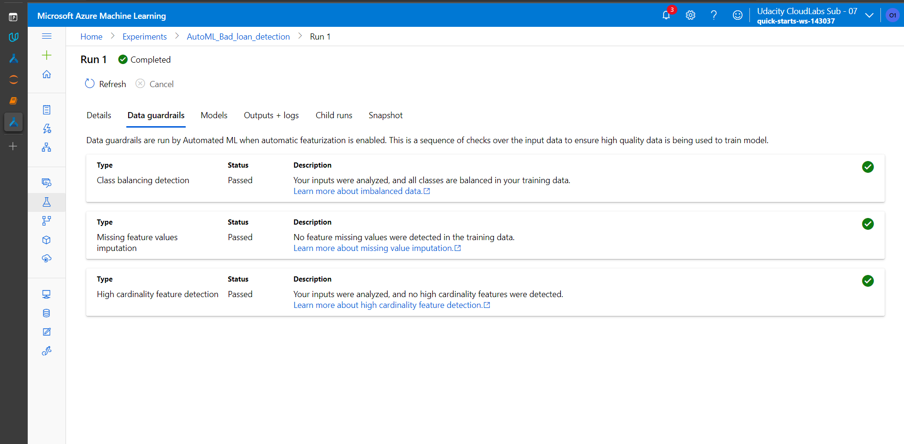

AutoML runs multiple models for the classification task and comes up with Voting Ensemlble as the best model with 0.68 auc_weighted metrics.
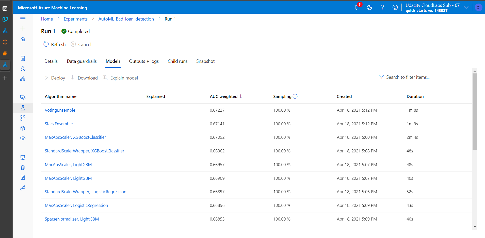
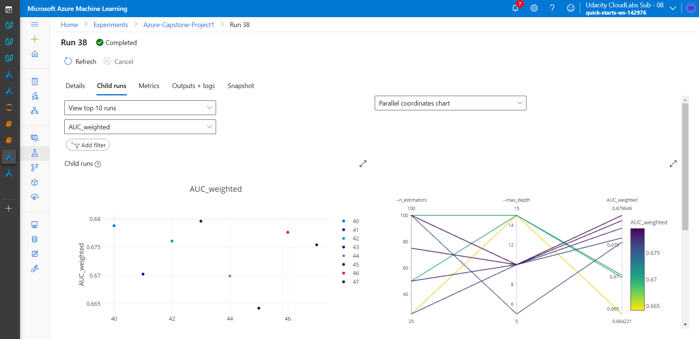
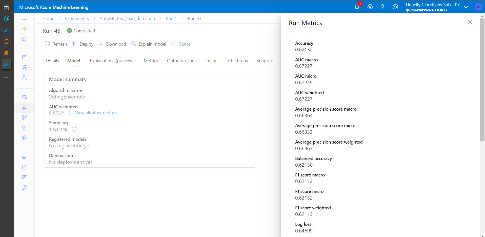
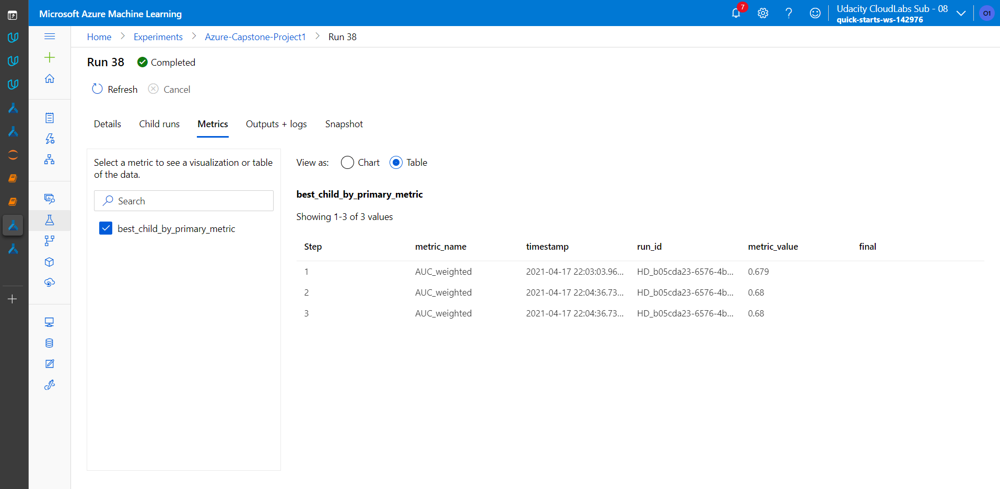
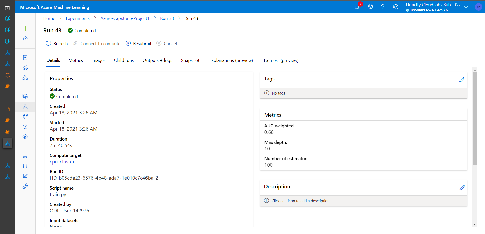

## Deploy the best model as Endpoint
I then deployed the best model as an endpoint REST service. And consumed it to test a few samples. Log can be seen once prediction is made.

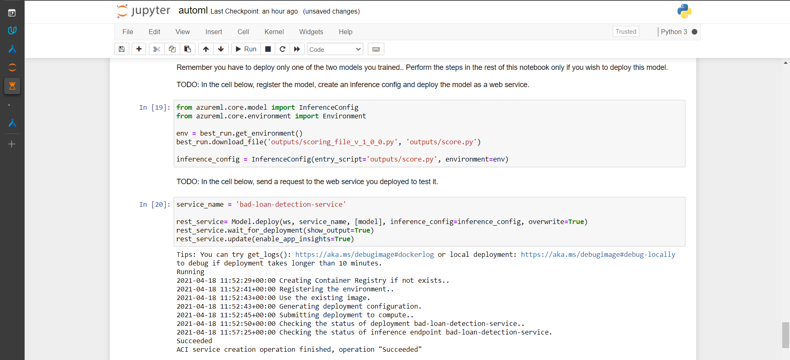
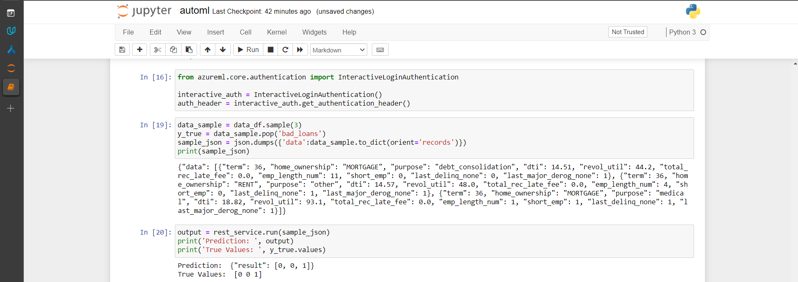
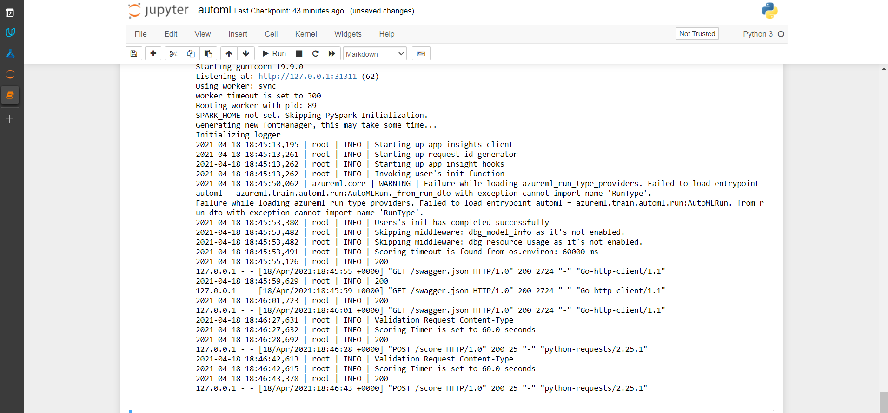

## Hyperdrive Experiment
I have also trained a RandomForestClassifier from scikitlearn using hyperdrive to configure the hypeparameters: "n_estimators" and "max_depth".

I have used below randomparameter sampling settings and bandit policy settings along with the hyperdrive config parameters. 
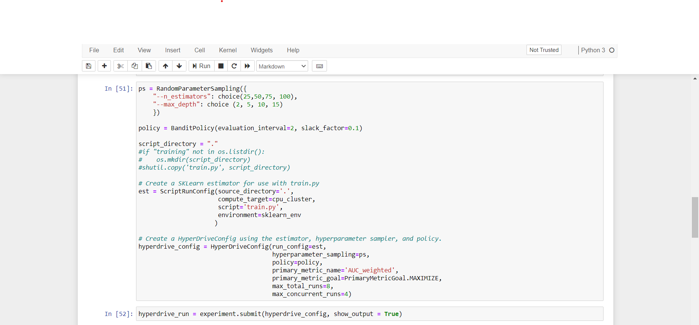

RunDetails widget is seen once the hyperdrive experiment is run.
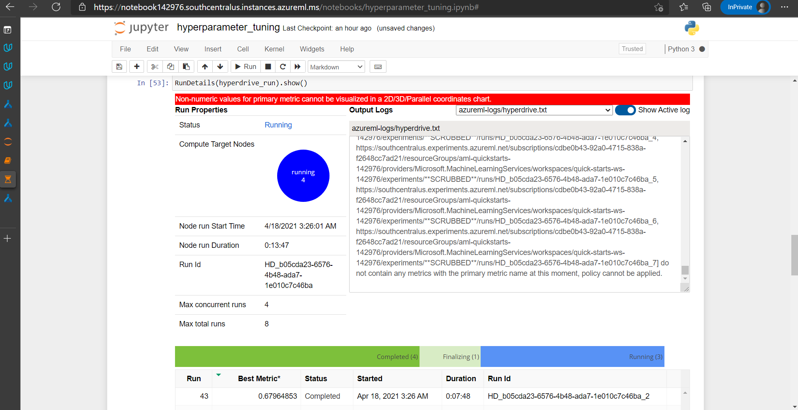

The gives maximum auc_wieghted of 0.679 from max_depth of 10 and n_estimators as 100.
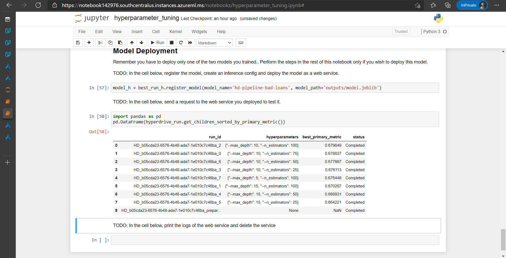
The best model is finally registered.
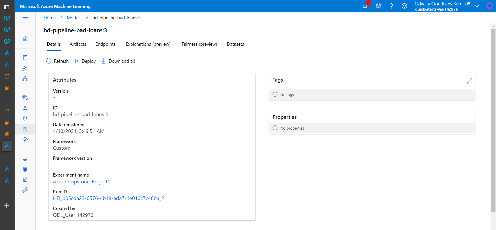

## Future Improvements

1. Run the AutoML for more time to find a better model.
2. Try with Deep Learning algorithms to improve the evaluation metrics and model performance.

